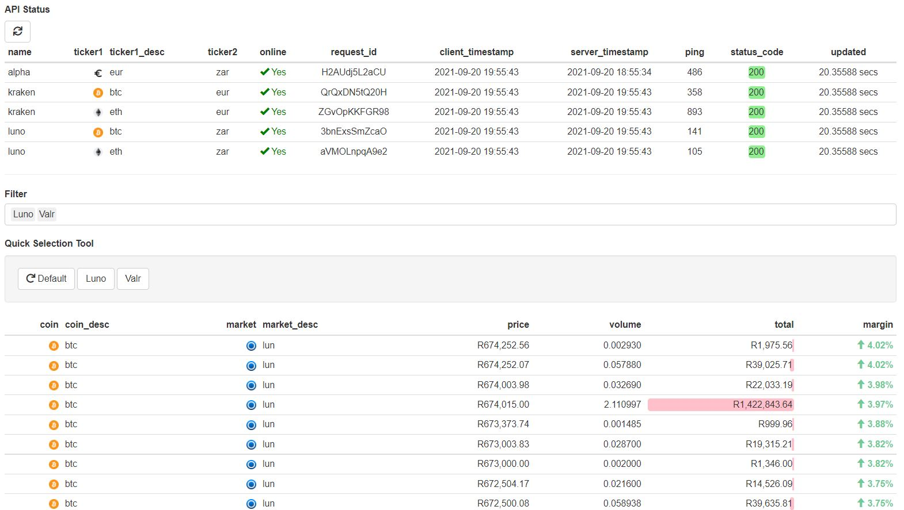

# Crypto Arbitrage Tracker and Trading Bot

The cryptocurrency abitrage tracker and trading bot is built using [Python](https://www.python.org/) (core), [R](https://www.r-project.org/) (vis), and [PostgreSQL](https://www.postgresql.org/) (database). It calculates in real time the abitrage premium of Bitcoin (and other cryptocurrencies) trading between [Kraken](https://www.kraken.com/) (international exchange) and [Luno](https://www.luno.com/)/ [VALR](https://www.valr.com/) (local South African exchange(s)).

<p align="center">
  
</p>

## Installation

# SQL - relational database

**1.** You'll need to setup a working version of [PostgreSQL](https://www.postgresql.org/). You can find the installation instructions [here](https://www.postgresql.org/).

**2.** Once installed, create a database named `catdb`.

**3.** Update the following files with the login details you created in `2.`.

```
'..\cat\sql\database\init.sql'
'..\cat\R\lib\postgresql.R'
'..\cat\python\lib\sql\postgresql\postgresql.py'
```

**4.** Open a new query, and run `../cat/sql/databse/init.sql`. This will set up the necessary tables for storing the data for the crypto bot.

# Python - backend

You can use any package manager you like (conda, pip, etc.) - you may even choose not to use any! Whichever path you take, make sure to have the following python packages installed, and the correct python version.

```
python==3.9.7
numpy==1.21.2
requests==2.26.0
psycopg2==2.9.1
```

You will also need to update `..\cat\python\lib\api\alpha\alpha.py` with your [Alpha](https://www.alphavantage.co/) api tocken(s). If you don't have one yet, you can create one [here](https://www.alphavantage.co/support/#api-key). This is a free api service to get realtime ticker data on the EUR/ZAR pair, please use it responsibly.

# R (and RStudio) - frontend

**1.** You'll need to setup a working version of [RStudio](https://www.rstudio.com/products/rstudio/#rstudio-desktop). You can find the installation instructions [here](https://www.rstudio.com/products/rstudio/#rstudio-desktop). You will also need to install [R](https://www.r-project.org/) from [here](https://www.r-project.org/).

## Run

**1.** Update the file `..\cat\cat.bat`. This will execute in batch the following python files, in sequence. If you'd prefer, you can simply run manually each of these scripts in turn.

```
1ping.py
2process.py
3fetch.py
```

**2.** Open RStudio and execute the R script `..\cat\R\app.R`. This will open an offline web-app and display the arbitrage pairs across Kraken and Luno, as well as the premiums available across the order book(s).

## P.S.

At the time of writing, the crypto bot is only able to show the arbitrage premiums across exchanges, but is not setup to automatically execute trades. Please check back later for this feature in a future update :)